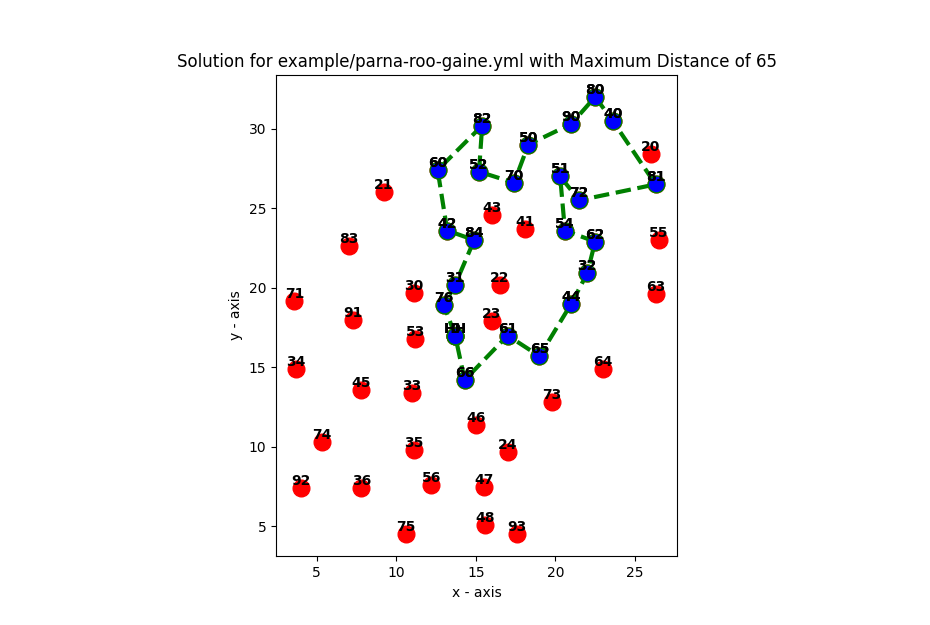

# rogaine-planner

Rogaine Planner is a tool to plan a route given the location of a set of controls and the maximum desired distance to travel.

# Usage
1. Clone the repo
1. Fill out `template.yml` with the details of the controls
    1. `max_distance`: the maximum distance the route will be
    1. `start_x_coord`: the 'x' coordinate of the hash house
    1. `start_y_coord`: the 'y' coordinate of the hash house
    1. `id`: the unique identifier of a control. Must be a 2 digit number
    1. `x_coord`: the 'x' coordinate of the control
    1. `y_coord`: the 'y' coordinate of the control
    1. Note on units: units can be whatever you wish, as long as you are consistent. e.g. Could be measured as real world distance (km), physical map distance (cm), screen distance (px). Reference point for 'x' and 'y' coordinates is 'bottom-left corner'.
1. `pip install -r requirements.txt`
1. `python3 main.py --file path/to/completed-template.yml`  
Script will produced text output with distance of the route, points accumulated on the route and the route itself. A window will open with a visual representation of the route.

# Output
Example based on the map of the [Parna-roo-gaine event](https://sarogaining.com.au/event/15-8-hour-roving-2024/).
```Distance: 62.49
Maximum Score: 1300
Optimal Path:
HH 76 31 84 42 60 82 52 70 50 90 80 40 81 72 51 54 62 32 44 65 61 66
```


# Explantion
The task of planning a route for a rogaine is an example of the [**Orienteering Problem**](https://www.sciencedirect.com/topics/mathematics/orienteering-problem)
> In the orienteering problem (also known as the “bank robber” problem, or the “generalized TSP”), the traveling salesperson is allowed to travel at most a distance B, and has the objective to maximize the number of sites that they can visit, subject to the distance constraint.  

The algorithm used in the script is derived from the work of Ali Etemadfard and Milad Nooraei. See 
[https://github.com/MiladNooraei/Orienteering-Problem](https://github.com/MiladNooraei/Orienteering-Problem)
